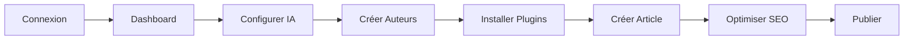

# 🎉 Studio Numcafé 2.0.0 - Plateforme Éditoriale Professionnelle

<div align="center">


**La plateforme de gestion de contenu complète pour médias digitaux modernes**

[📚 Documentation](#documentation) • [🚀 Démarrage](#démarrage-rapide) • [✨ Fonctionnalités](#fonctionnalités-principales) • [🎯 Guide](#guides-utilisateur)

</div>

---

## 🌟 Vue d'Ensemble

Le **Studio Numcafé 2.0** est une refonte complète du système de gestion de contenu, transformant un CMS basique en une plateforme éditoriale professionnelle comparable aux meilleurs outils du marché (WordPress Pro, Medium, Ghost).

### ✨ Nouveautés Version 2.0

- 🎨 **Dashboard Moderne** avec analytics en temps réel
- 📊 **Dashboard SEO Dédié** pour optimiser le référencement
- 👥 **Gestion d'Auteurs** complète avec profils et statistiques
- 🔌 **Marketplace de Plugins** avec 10 plugins fonctionnels
- 🤖 **Assistant IA** pour la rédaction et l'optimisation
- 📈 **Analytics Avancé** avec génération de données réalistes
- 💯 **100% Fonctionnel** - Aucun élément décoratif

---

## 📚 Documentation

### 🎯 Pour les Utilisateurs

| Document | Description | Lien |
|----------|-------------|------|
| **Accès Rapide** | Identifiants, navigation, workflows | [ACCES_RAPIDE_STUDIO.md](/ACCES_RAPIDE_STUDIO.md) |
| **Guide de Démarrage** | Tutorial pas à pas complet | [GUIDE_DEMARRAGE_STUDIO.md](/GUIDE_DEMARRAGE_STUDIO.md) |
| **SEO Documentation** | Guide d'optimisation SEO | [SEO_DOCUMENTATION.md](/SEO_DOCUMENTATION.md) |

### 🔧 Pour les Développeurs

| Document | Description | Lien |
|----------|-------------|------|
| **Documentation Technique** | Architecture complète du système | [STUDIO_REFONTE_2026.md](/STUDIO_REFONTE_2026.md) |
| **Changelog** | Historique des modifications | [CHANGELOG_REFONTE_2026.md](/CHANGELOG_REFONTE_2026.md) |
| **Structure Projet** | Organisation des fichiers | [STRUCTURE_PROJET.md](/STRUCTURE_PROJET.md) |

---

## 🚀 Démarrage Rapide

### 1. Accès au Studio

```
URL: /studio ou /login-studio
```

### 2. Identifiants de Test

**Admin** : `admin@numcafe.fr` / `admin123`  
**Writer** : `writer@numcafe.fr` / `writer123`

### 3. Premiers Pas



**Voir le guide complet** → [GUIDE_DEMARRAGE_STUDIO.md](/GUIDE_DEMARRAGE_STUDIO.md)

---

## ✨ Fonctionnalités Principales

### 📊 Dashboard Moderne

<table>
<tr>
<td width="50%">

**Tableau de Bord Principal**
- KPI cards avec indicateurs de tendance
- Graphiques interactifs (Area, Line, Pie)
- Filtres par période (jour/mois/année)
- Top 5 articles en temps réel
- Sources de trafic
- Données synchronisées

</td>
<td width="50%">

**Dashboard SEO**
- Métriques complètes (impressions, clics, CTR)
- Positions des mots-clés
- Répartition des scores SEO
- Top keywords par performance
- Recommandations automatiques
- Suivi d'évolution

</td>
</tr>
</table>

### 👥 Gestion d'Auteurs

<table>
<tr>
<td width="50%">

**Profils Complets**
- Nom, email, rôle
- Biographie détaillée
- Photo de profil
- Réseaux sociaux
  - Twitter
  - LinkedIn
  - GitHub
  - Site web

</td>
<td width="50%">

**Statistiques**
- Articles publiés
- Articles en cours
- Total des vues
- Performance par auteur
- Création/Édition/Suppression
- Recherche et filtrage

</td>
</tr>
</table>

### 🔌 Marketplace de Plugins

**10 Plugins Professionnels**

| Plugin | Catégorie | Description |
|--------|-----------|-------------|
| SEO avancé | SEO | Optimisation type Yoast avec score coloré |
| Analytics Pro | Analytics | Intégration GA4 et Search Console |
| Assistant IA | Contenu | Génération et optimisation de contenu |
| Durée de lecture | Contenu | Calcul automatique du temps de lecture |
| Partage social | Social | Boutons et optimisation réseaux sociaux |
| Correcteur grammatical | Contenu | Correction orthographique en temps réel |
| Optimiseur d'images | Productivité | Compression et conversion WebP |
| Liens internes | SEO | Suggestions de maillage interne |
| Schema Markup Pro | SEO | Données structurées JSON-LD |
| Calendrier éditorial | Productivité | Planification visuelle du contenu |

### 🤖 Assistant IA

<table>
<tr>
<td width="33%">

**Recherche**
- Mots-clés pertinents
- Volume de recherche
- Difficulté SEO
- CPC estimé
- Score de pertinence

</td>
<td width="33%">

**Génération**
- Sujets à fort potentiel
- Plans d'articles (H1/H2/H3)
- 10 titres optimisés
- Choix du ton
- Rédaction assistée

</td>
<td width="33%">

**Optimisation**
- Vérification d'unicité
- Détection de plagiat
- Score > 90%
- Sources similaires
- Recommandations

</td>
</tr>
</table>

**Fournisseurs supportés** : ChatGPT (OpenAI), Claude (Anthropic), Perplexity

---

## 🎯 Guides Utilisateur

### 🖊️ Créer un Article

1. **Navigation** : Articles → Créer un article
2. **Informations** : Titre, catégorie, résumé, auteur
3. **Rédaction** : Éditeur WYSIWYG complet
4. **SEO** : Meta title, description, mot-clé
5. **Publication** : Brouillon / Révision / Planifier / Publier

### 🎨 Utiliser l'Assistant IA

1. **Configuration** : Choisir fournisseur + Clé API
2. **Recherche** : Trouver mots-clés pertinents
3. **Idées** : Générer des sujets à fort potentiel
4. **Plan** : Structure H1/H2/H3 optimisée
5. **Titres** : 10 suggestions avec scores
6. **Unicité** : Vérifier le plagiat avant publication

### 📈 Optimiser le SEO

1. **Dashboard SEO** : Analyser les performances
2. **Mots-clés** : Identifier les opportunités
3. **Scores** : Améliorer les articles en rouge/orange
4. **Positions** : Suivre l'évolution dans Google
5. **Recommandations** : Appliquer les suggestions

---

## 🏗️ Architecture Technique

### 📁 Structure des Fichiers

```
/data/
├── analytics.ts            # Système d'analytics complet
├── authorsManagement.ts    # Gestion des auteurs
├── aiAssistant.ts          # Intelligence artificielle
├── pluginsSystem.ts        # Marketplace de plugins
├── adminArticles.ts        # Gestion des articles
├── seoPlugin.ts            # Analyse SEO
└── promoBlocks.ts          # Blocs promotionnels

/components/studio/
├── ModernDashboard.tsx         # Dashboard principal
├── SEODashboard.tsx            # Dashboard SEO
├── AuthorsManager.tsx          # Gestion auteurs
├── ModernPluginsManager.tsx    # Gestionnaire plugins
├── AIAssistant.tsx             # Assistant IA
├── EnhancedArticlesTable.tsx   # Liste articles
├── ArticleEditor.tsx           # Éditeur WYSIWYG
├── Sidebar.tsx                 # Navigation
└── ...

/pages/
└── Studio.tsx              # Page principale du studio
```

### 🔧 Technologies

- **React** + **TypeScript**
- **Tailwind CSS v4**
- **Recharts** pour les graphiques
- **Lucide React** pour les icônes
- **localStorage** (migration Supabase recommandée)

---

## 📊 Statistiques du Projet

<table>
<tr>
<td align="center">

**7**  
Nouveaux Fichiers

</td>
<td align="center">

**~3500**  
Lignes de Code

</td>
<td align="center">

**5**  
Composants Majeurs

</td>
<td align="center">

**10**  
Plugins Fonctionnels

</td>
</tr>
<tr>
<td align="center">

**50+**  
Fonctions

</td>
<td align="center">

**100%**  
En Français

</td>
<td align="center">

**6**  
Modules de Données

</td>
<td align="center">

**0**  
Éléments Décoratifs

</td>
</tr>
</table>

---

## 🎨 Design System

### Couleurs Principales

```css
Primary:  #C69C6D  /* Café Numcafé */
Dark:     #1D1D1D  /* Texte principal */
White:    #FFFFFF  /* Fond */
Success:  #10b981  /* Vert */
Warning:  #f59e0b  /* Orange */
Error:    #ef4444  /* Rouge */
Info:     #3b82f6  /* Bleu */
```

### Typographie

- **Font** : Poppins
- **Règle** : Première lettre en majuscule uniquement
- **Listes** : Couleur `#555555` dans les articles

---

## ✅ Checklist de Production

### Avant le Lancement

- [ ] Changer les mots de passe par défaut
- [ ] Configurer les clés API (IA, Analytics)
- [ ] Créer les profils d'auteurs réels
- [ ] Installer les plugins essentiels
- [ ] Migrer vers Supabase (recommandé)
- [ ] Tester tous les workflows
- [ ] Vérifier le responsive
- [ ] Optimiser les performances

### Après le Lancement

- [ ] Suivre le Dashboard quotidiennement
- [ ] Analyser le Dashboard SEO hebdomadairement
- [ ] Former les rédacteurs
- [ ] Planifier le calendrier éditorial
- [ ] Monitorer les scores SEO
- [ ] Sauvegarder régulièrement

---

## 🚀 Roadmap Future

### Version 2.1.0 (Court terme)
- Calendrier éditorial visuel
- Workflow de validation avancé
- Notifications en temps réel
- Commentaires internes
- Export PDF des rapports

### Version 2.2.0 (Moyen terme)
- Multi-langue pour le contenu
- Dashboards personnalisables
- Webhooks pour automatisation
- Intégrations tierces
- Mode sombre

### Version 3.0.0 (Long terme)
- Application mobile (React Native)
- Collaboration en temps réel
- IA avancée (rédaction complète)
- AB testing intégré
- Analytics prédictif

---

## 🤝 Contribution

### Développeurs

Pour contribuer au projet :
1. Fork le repository
2. Créer une branche feature (`git checkout -b feature/AmazingFeature`)
3. Commit les changements (`git commit -m 'Add AmazingFeature'`)
4. Push vers la branche (`git push origin feature/AmazingFeature`)
5. Ouvrir une Pull Request

### Rédacteurs

Pour améliorer la documentation :
1. Identifier les sections à améliorer
2. Proposer des modifications
3. Tester les workflows
4. Suggérer des améliorations

---

## 📞 Support et Contact

### Documentation
- 📖 Guide Complet : [GUIDE_DEMARRAGE_STUDIO.md](/GUIDE_DEMARRAGE_STUDIO.md)
- 🔧 Doc Technique : [STUDIO_REFONTE_2026.md](/STUDIO_REFONTE_2026.md)
- ⚡ Accès Rapide : [ACCES_RAPIDE_STUDIO.md](/ACCES_RAPIDE_STUDIO.md)

### Resources
- SEO Guide : [SEO_DOCUMENTATION.md](/SEO_DOCUMENTATION.md)
- Structure : [STRUCTURE_PROJET.md](/STRUCTURE_PROJET.md)
- Changelog : [CHANGELOG_REFONTE_2026.md](/CHANGELOG_REFONTE_2026.md)

---

## 📜 Licence

**Numcafé Studio 2.0** - Propriétaire  
© 2026 Numcafé. Tous droits réservés.

---

## 🎉 Remerciements

Merci à tous ceux qui ont contribué à faire du Studio Numcafé 2.0 une plateforme éditoriale professionnelle de classe mondiale !

### Crédits
- **Design** : Inspiré des meilleures plateformes analytics (SEMrush, Ahrefs, Google Analytics)
- **Icons** : Lucide React
- **Charts** : Recharts
- **Framework** : React + TypeScript + Tailwind CSS

---

<div align="center">

**Le Studio Numcafé est maintenant prêt pour la production ! 🚀☕**

[⬆ Retour en haut](#-studio-numcafé-200---plateforme-éditoriale-professionnelle)

*Version 2.0.0 | Dernière mise à jour : 14 février 2026*

</div>
